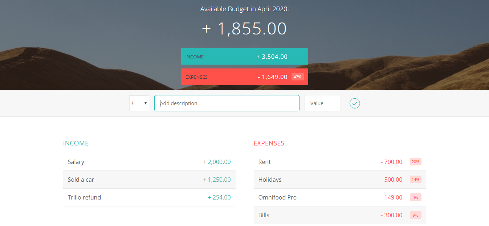

<!-- PROJECT LOGO -->

<!-- PROJECT NAME -->
# Budgety APP
Budgety is a web browser application for personal budget management. Its main goal is to learn the basics of JavaScript.

<!-- TABLE OF CONTENTS -->
## Table of Contents
* [About the Project](#about-the-project)
	* [ES5](#es5)
	* [Module Pattern](#module-pattern)
	* [Project Structure](#project-structure)
* [Getting Started](#getting-started)
	* [Prerequisites](#prerequisites)
	* [Installing](#installing)
* [Usage](#usage)
* [Built With](#built-with)
* [Authors](#authors)
* [License](#license)
* [Contact](#contact)
* [Acknowlegments](#acknowledgements)


## About the Project


Budgety is a Web App developed by Jonas Schmedtmann in the Udemy course [The Complete JavaScript Course 2020](https://www.udemy.com/course/the-complete-javascript-course/). I wrote this code to learn the advanced techniques used nowadays to develop modern Web App's. Besides, this code will help to develop other Web App's as a code reference.

The focusing part of this project is the use of JavaScript **ES5**. All the project uses a legacy JavaScript code used in past old days when node.js doesn't brightened our days.

**Notes**
>The code is full of Spanish comments.


### ES5
JavaScript ES5 is a shortcut of ECMAScript 5, released in 2009. The most significal changes are:
* The "use strict" Directive
* Property Getters and Setters
* New Object Property Methods
* String.trim()
* Array.isArray()
* Array.forEach()
* Array.map()
* Array.filter()
* Array.indexOf()
* JSON.parse()
* JSON.stringify()
* Date.now()
* And many more!

### Module Pattern
JavaScript Module Pattern is one of the most common Design Patterns used in JavaScript projects and helps us to organize and isolate the different functions that we are working on through encapsulation of our code. It is really easy to use!

Modules are commonly used as singleton style objects where only one instance exists and there are many different variations of the module patter, but I'll cover the basics Module Pattern in ES5. I'm talking about the use of anonymous closure: this are just functions that wrap our code and create an enclosed scope around it. Closures are one of the best and most powerful features of JavaScript.

The most common pattern is well known as a Immediately Invoked Function Expression (IIFE). This kind of function is evaluated then immediately invoked. It looks like this:

```js
(function() {
  // Code here
})();
```
It looks really simple, but it's tricky. We can assign the module to a variable that can we use to call our module methods. In one hand, JavaScript does not have a private keyword to declare private attributes or methods, but we can use closures to add a private state. On the other hand, to expose the methods used in the module to the outside code, we need to return and object.

```js
var myModule = (function() {
    // PRIVATE
    var _privateProperty = 'Hello World';
    var publicProperty = 'Hello World';

    var _privateMethod = function() {
        // Code here
    };

    // PUBLIC
    return {
        publicMethod: function() {
            return publicProperty;
        },
        anotherPublicMethod: function() {
            // Code here
        }
    }
})();

myModule.publicMethod(); // Returns 'Hello World'
console.log(myModule._privateProperty); // Returns Undefined
```
Our private properties are not available outside of the module, they return as Undefined. Only our public method has given us access to our private attribute. This gives us ability to create private state and encapsulation within our code.

**NOTE**
>Because JavaScript does not have a private keyword, its common to prefix private properties with an underscore.


### Project Structure
The project has been developed taking in mind a classic folder distribution:
* **js**: the JavaScript code are here.
* **css**: background image and CSS code are located in this folder.
* *index.html*: our Web App. Just HTML code.

But the most important part is the **app.js** file. Inside this, we have all the functionality of this web application, using a Module Pattern to divide the code in three controllers: budget controller, UI controller and the main controller. This kind of architecture is a pseudo MVC pattern. We use the budget controller to handle the data structure. UI controller is used to render the view in the we browser. And finally, the main controller, where we handle all kind of Event Listeners and the public methods of the other two modules. Sounds confusing but it's a really simple software architecture.


<!-- GETTING STARTED -->
## Getting Started
To setting up the project locally you can download a copy of this project clicking on the *Clone or download* and then *Download ZIP*, or you can follow these simple example steps to get a copy of Budgety on your repository.

### Prerequisites
There is no prerequisites to run this Web App, just a web browser!

### Installing
No need to install!


<!-- USAGE -->
## Usage
Feel free to use this code (see more on [license](#license)).
* Watch and interact with the different elements along the Web App.
* With your web browser, you can inspect all the elements to know how was built.
* You can used it for personal budget management.

## Built with
This project is plugin free. You don't need nothing to run it!

<!-- CONTRIBUTING -->
## Contributing
Contributions are what make the open source community such an amazing place to learn, inspire and create. Any contributions you make are **greatly appreciated**.

1. Fork the project.
2. Create your Feature Branch: `git checkout -b feature/example-name`.
3. Commit your changes: `git commit -m 'Add some features'`.
4. Push to the Branch: `git push origin feature/example-name`.
5. Open a Pull Request.

<!-- AUTHORS -->
## Authors
* **Guillem Martí**: built and documentation

<!-- LICENCE -->
## License
The license of this project is from [Jonas Schmedtmann](http://codingheroes.io). The code of this project is open source to learn but not for commercial purposes.

<!-- CONTACT -->
## Contact
Guillem Martí - [@guimarbe](https://twitter.com/guimarbe)

<!-- ACKNOWLEDGEMENTS -->
## Acknowledgements
* [atom](https://atom.io/) - My preferred text editor
* [Emmet](https://emmet.io/)
* [Unsplash](https://unsplash.com/)
* [Ionicons](https://www.ionicons.com/)
